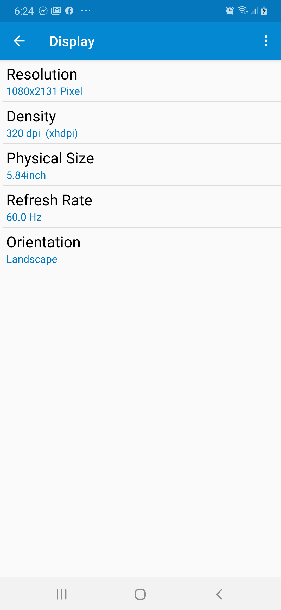
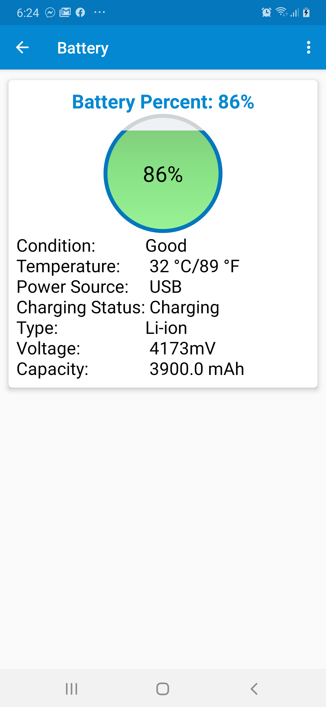

# DeviceInfo
Android IDS

systrace command-line utility, but the app allows you to record traces directly from a test device itself,
without needing to plug in the device and connect to it over
ADB. You can then use the app to share results from these traces with your development team.

